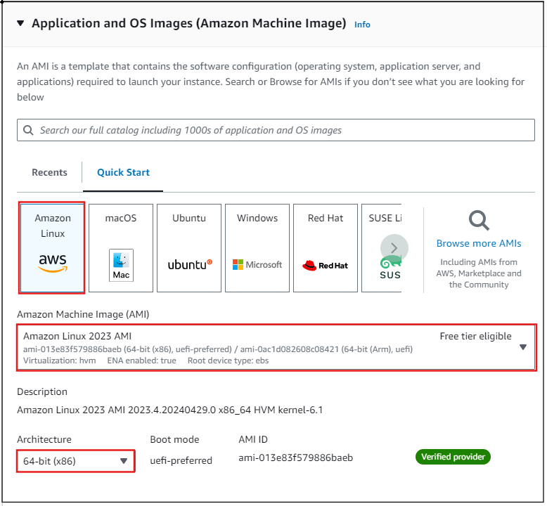
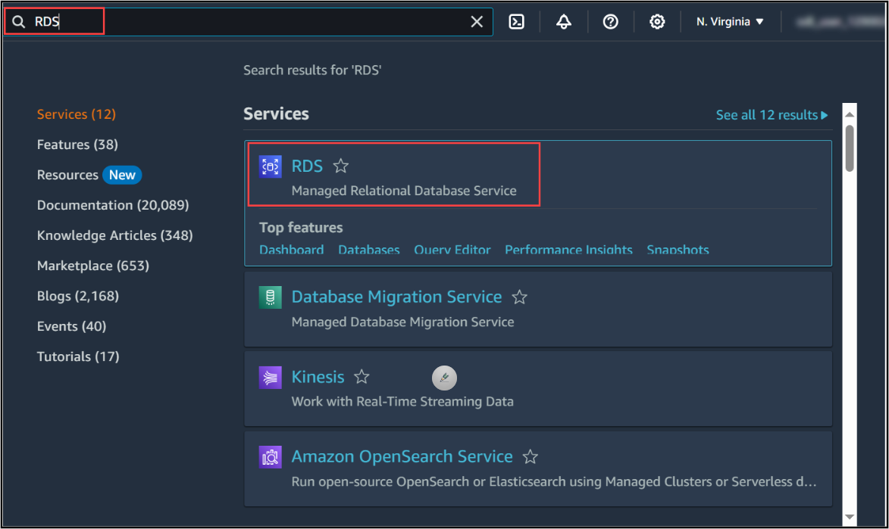
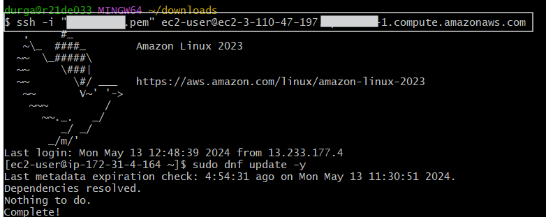

# Connecting an AWS RDS DB Instance to EC2

Follow the steps below to get started with the lab.

1. Sign in to the AWS Management Console by copying the Sign-in link, Username, and Password provided below.
   - Sign-in Link:
   - IAM Username:
   - Password:


Alternatively, you can also find these values on the CloudLabs Environment tab.


2. After signing in to the AWS Management Console, choose the region US-EAST-1 (N. Virginia) from the dropdown menu.


Note: You can deploy the resources in any of the six regions mentioned below:
- us-east-1 (N. Virginia)
- us-east-2 (Ohio)
- us-west-2 (Oregon)
- eu-central-1 (Frankfurt)
- eu-west-2 (London)
- ap-southeast-1 (Singapore)

***
# Connecting an AWS RDS DB Instance to EC2

## Overview
#### Lab Duration: 1 Hour


Amazon Relational Database Service (Amazon RDS) is a web service that makes it easier to set up, operate, and scale a relational database in the AWS Cloud. It provides cost-efficient, resizable capacity for an industry-standard relational database and manages common database administration tasks. With RDS, you can use the database products you are already familiar with like Db2, MariaDB, Microsoft SQL Server, MySQL, Oracle, and PostgreSQL. Amazon RDS manages backups, software patching, automatic failure detection, and recovery.

In addition to the security in your database package, you can help control who can access your RDS databases. To do so, you can use AWS Identity and Access Management (IAM) to define users and permissions. You can also help protect your databases by putting them in a virtual private cloud (VPC).

## Key Learnings

In this hands-on lab, you will be learning the following:
- Understanding of Amazon RDS
- Creating and configuring EC2 instances.
- Creating and configuring the RDS DB instance
- Connecting and configuring the EC2 instance with RDS DB instance
- Familiarity with MySQL databases and their command line clients

## Hands-on Lab
Exercise 1: Creating an EC2 Instance
Exercise 2: Creating an RDS Instance
Exercise 3: Connecting RDS DB to EC2 Instance

## Exercise 1: Creating an EC2 Instance

In this task, you will be creating an EC2 instance in the public subnet of your VPC for it to access the internet. To create the EC2 instance, follow the given steps below:

1. On the AWS homepage, click on the search bar, and enter **EC2** and select the AWS EC2 service as displayed in the results.


2. You will be directed to the EC2 Dashboard page.
Select Launch Instance to create an instance.


3. On the page named **Launch an EC2**, under Name and tags field, give the Name as **"my-Instance"**


4. Under Application and OS Images (Amazon Machine Image) section,
   - Let Amazon Machine Image (AMI) be default as Amazon Linux 2023 AMI
   - Let Architecture to default as 64 bit.


   
5. Keep Instance type to default as t2.micro 


6. Under Key pair (login), select Create a new key pair and provide Key pair name as Web_Server_Key.
   - Leave other settings to default and select Create key pair.


Note: You will be asked to download the key pair. Download it in a directory where you can access it later.

7. Under Network Settings:
   - Keep Allow SSH traffic from checkbox selected.
   - Select Allow HTTP traffic from the internet checkbox to access any web server instance over HTTP on the internet.
   - Let all other network settings be default.


8. Let all other settings such as **Configure storage** be default and click on  **Launch instance** to launch the instance. Your instance will be launched. 


9. Select **View all instances** to view the running instance.


10. Finally, you can see the instance running in the EC2 Dashboard. Note that, one minute after the instance starts running, the status check appears as **2/2 checks passed**.

Note: You can move forward with the further exercises as you wait for the Status Check to be passed.


In this exercise, you have successfully created an EC2 instance.

***

## Exercise 2: Creating an AWS RDS Instance

#### In this task, you will create an Amazon RDS database in the same VPC as your EC2 instance to connect with it.

1. On the search bar, type **RDS** and select the RDS service. You will be navigated to RDS dashboard.



2. Click on **Create database** to start creating your database.


3. Select database creation method to **Easy create**.  Select Free tier in Templates field.


4. Under Configuration, select **MySQL** as the Engine type and keep other options as default.


5. Select **Free tier** for DB instance size 


6. Under the below settings, do the following:
    - Set DB instance identifier to **database-2** or any other name you like, to identify your database instance uniquely over the region in your AWS account.
    - Keep Master username to **'admin'** as default.
    - Keep Credentials management to **'Self managed'** and provide the password as **'admin123'** in the Master password field.
    - Confirm the Password by retyping **'admin123'**


7. Click on **Set up EC2 connection** and under it, 
    - Select **Connect to an EC2 compute resource** 
    - In **EC2 instance** field , select the *dropdown menu* and you can view the instance you had created named **"my-instance"**
    - Select the instance which is visible.
    - Note: The database instance will be created in the same VPC where your web server instance is created.


8. Click on **Create database**


9. You can view the database which is being created. Let the status of the Database be **Available** only then further steps are possible


10. Click on the database which is created and copy the Endpoint and port number under Connectivity and security section on a notepad. 


***

## Exercise 3: Connecting to the created MySQL DB instance

1. In the search bar, type **EC2**.


2. In the EC2 dashboard, you can select your instance. Find the option **Connect** on top right corner and click that option.


3. In **EC2 Instance Connect** section, set everything to default and click on **Connect** option.


4. You will be navigated to another tab to open SSh. Follow the further steps accordingly.


5. Type the following command and click enter:

   ```bash
   ssh -i location_of_pem_file ec2-user@ec2-instance-public-dns-name
   ```
   For example, assume that ec2-database-connect-key-pair.pem is stored in /dir1 on Linux, and the public IPv4 DNS for your EC2 instance is ec2-12-345-678-90.compute-1.amazonaws.com. Your SSH command would look as follows:

   ```bash
   ssh -i ec2-database-connect-key-pair.pem ec2-user@ec2-12-345-678-90.compute-1.amazonaws.com
   ```



6. Get the latest bug fixes and security updates by updating the software on your EC2 instance. To do this, use the following command:
    ```bash
    sudo dnf update -y
    ```

9. To install the mysql command line client from MariaDB on Amazon Linux 2023, run the following command:
    ```bash
    sudo dnf install mariadb105
    ```


10. Connect to the MySQL DB instance using the MySQL client. Substitute the DB instance endpoint (DNS name) for *endpoint*, and substitute the master username that you used for *admin*. Provide the master password that you used when prompted for a password.
    ```bash
    mysql -h <endpoint> -P 3306 -u admin -p
    ```
    

11. Enter the password **admin123** for the user, you should see output similar to the following:
    ```
    Welcome to the MariaDB monitor.
    Commands end with ; or \g.
    Your MySQL connection id is 3082
    Server version: 8.0.28 Source distribution
    ```
12. Type 'help;' or '\h' for help. Type '\c' to clear the current input statement.
    ```bash
    MySQL [(none)]> 
    ```

13. Run SQL commands. For example, the following SQL command shows the current date and time:
    ```sql
    SELECT CURRENT_TIMESTAMP;
    ```
    
  

##### Therefore, In this Lab, you have learnt how to create an EC2 instance, how to create RDS DB instance, and finally learnt how to connect RDS DbBinstance through EC2.